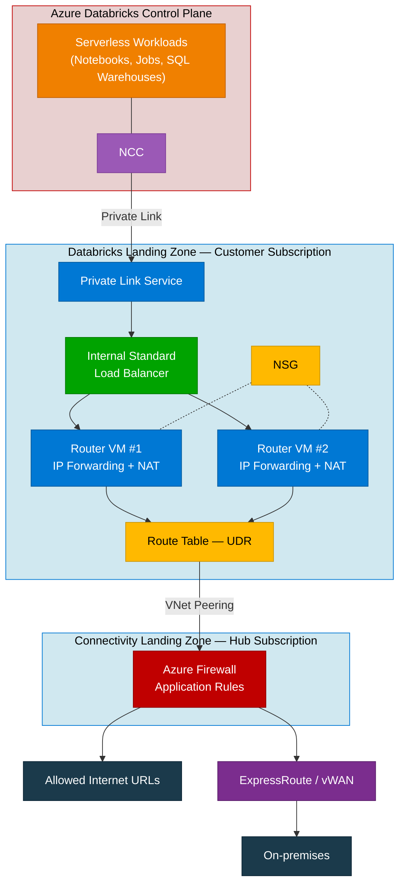

# Azure Databricks Serverless 네트워크 구성 가이드

> **목적**: Azure Databricks Serverless 환경에서 고객 가상 네트워크(VNet)의 리소스에 Private Link를 통해 안전하게 접근하기 위한 네트워크 구성을 단계별(Step-by-Step)로 안내합니다. Azure Firewall을 통한 아웃바운드 트래픽 제어와 deny-by-default 보안 정책을 구현합니다.

> **대상**: Azure Databricks Serverless 환경의 네트워크 보안을 강화하려는 클라우드 아키텍트, 네트워크 엔지니어 및 인프라 관리자

> **최종 수정**: 2026-04-15

> **원문 참고**: [Securing Azure Databricks Serverless: Practical Guide to Private Link Integration](https://techcommunity.microsoft.com/blog/analyticsonazure/securing-azure-databricks-serverless-practical-guide-to-private-link-integration/4457083)

---

## 목차

- [1. 개요](#1-개요)
  - [1.1 배경 및 과제](#11-배경-및-과제)
  - [1.2 솔루션 목표](#12-솔루션-목표)
  - [1.3 아키텍처 개요](#13-아키텍처-개요)
  - [1.4 트래픽 흐름](#14-트래픽-흐름)
- [2. 사전 요구 사항](#2-사전-요구-사항)
- [3. Step 1: Azure Firewall 및 네트워크 배포](#3-step-1-azure-firewall-및-네트워크-배포)
  - [3.1 Virtual Network 생성](#31-virtual-network-생성)
  - [3.2 Azure Firewall 배포](#32-azure-firewall-배포)
  - [3.3 VNet Peering 구성](#33-vnet-peering-구성)
- [4. Step 2: Azure Standard Load Balancer 구성](#4-step-2-azure-standard-load-balancer-구성)
  - [4.1 Load Balancer 생성](#41-load-balancer-생성)
  - [4.2 Frontend IP 구성](#42-frontend-ip-구성)
  - [4.3 Backend Pool 구성](#43-backend-pool-구성)
  - [4.4 Health Probe 구성](#44-health-probe-구성)
  - [4.5 Load Balancing Rule 구성](#45-load-balancing-rule-구성)
- [5. Step 3: Private Link Service 생성](#5-step-3-private-link-service-생성)
- [6. Step 4: Route Table (UDR) 설정](#6-step-4-route-table-udr-설정)
- [7. Step 5: Router VM 배포 및 구성](#7-step-5-router-vm-배포-및-구성)
  - [7.1 Linux VM 배포](#71-linux-vm-배포)
  - [7.2 IP Forwarding 활성화](#72-ip-forwarding-활성화)
  - [7.3 IPTables NAT 구성](#73-iptables-nat-구성)
  - [7.4 NGINX Health Probe 서버 구성](#74-nginx-health-probe-서버-구성)
  - [7.5 (권장) 두 번째 Router VM 배포](#75-권장-두-번째-router-vm-배포)
- [8. Step 6: Network Security Group (NSG) 구성](#8-step-6-network-security-group-nsg-구성)
- [9. Step 7: Azure Firewall Application Rule 구성](#9-step-7-azure-firewall-application-rule-구성)
- [10. Step 8: Databricks Account Portal 설정](#10-step-8-databricks-account-portal-설정)
  - [10.1 Network Connectivity Configuration (NCC) 생성](#101-network-connectivity-configuration-ncc-생성)
  - [10.2 NCC를 Workspace에 연결](#102-ncc를-workspace에-연결)
  - [10.3 Private Endpoint Rule 추가](#103-private-endpoint-rule-추가)
  - [10.4 (선택) Network Policy 설정](#104-선택-network-policy-설정)
- [11. Step 9: Private Endpoint 승인](#11-step-9-private-endpoint-승인)
- [12. Step 10: 연결 검증](#12-step-10-연결-검증)
- [13. 트러블슈팅](#13-트러블슈팅)
- [14. 참고 자료](#14-참고-자료)

---

## 1. 개요

### 1.1 배경 및 과제

Azure Databricks Serverless는 노트북, 작업(Job), 파이프라인 등을 위한 관리형 컴퓨팅을 제공하여 사용 편의성과 확장성을 극대화합니다. 그러나 **기본적으로 Serverless 컴퓨팅에서의 아웃바운드 트래픽은 인터넷 및 기타 네트워크에 자유롭게 접근**할 수 있습니다.

금융, 정부, 헬스케어 등 규제 산업에서는 다음과 같은 요구 사항이 있습니다:

- 모든 네트워크 경로를 프라이빗 네트워크 내에서 유지
- 아웃바운드 트래픽에 대한 세밀한 제어 및 감사
- 데이터 유출(Exfiltration) 방지를 위한 deny-by-default 정책

### 1.2 솔루션 목표

| 목표 | 설명 |
|------|------|
| **Deny-by-default 정책** | 기본적으로 모든 아웃바운드 접근을 차단하고, Private Endpoint Rule을 통해 명시적으로 허용된 대상만 접근 허용 |
| **아웃바운드 연결 제어** | 허용된 위치, 연결, FQDN을 지정하여 아웃바운드 연결 제어 |
| **고객 네트워크를 통한 트래픽 라우팅** | 모든 트래픽이 고객 네트워크를 경유하도록 강제하여 트래픽 검사 및 제어 수행 |

### 1.3 아키텍처 개요

이 솔루션은 Databricks Serverless의 아웃바운드 트래픽을 **고객 관리형 정책 실행 지점(Policy Enforcement Point)** 인 Azure Firewall로 라우팅합니다. 이를 통해 클라우드에서 호스팅되는 서비스에 공용 인터넷 노출 없이 안전하게 연결할 수 있습니다.

#### 핵심 구성 요소



| 구성 요소 | 역할 |
|-----------|------|
| **NCC (Network Connectivity Configuration)** | Databricks 계정 수준에서 Serverless 컴퓨팅의 네트워크 연결을 관리하는 구성 객체 |
| **Private Link Service** | Databricks Control Plane에서 고객 VNet의 Load Balancer로 프라이빗 연결을 제공 |
| **Internal Standard Load Balancer** | Private Link Service의 백엔드로, Router VM에 트래픽을 분배 |
| **Router VM** | IP Forwarding 및 NAT를 수행하여 트래픽을 Azure Firewall로 전달 |
| **Azure Firewall** | FQDN 기반 Application Rule로 아웃바운드 트래픽을 필터링 |
| **Route Table (UDR)** | Router VM의 기본 경로를 Azure Firewall로 지정 |
| **NSG** | 서브넷 수준에서 인바운드/아웃바운드 트래픽을 세밀하게 제어 |

### 1.4 트래픽 흐름

Databricks Serverless에서 고객 리소스로의 트래픽 흐름:

1. **Databricks Serverless 워크로드** (노트북, Job, SQL Warehouse 등)가 고객 리소스에 접근 요청
2. **NCC의 Private Endpoint Rule**을 통해 → **Private Link Service**로 프라이빗 연결
3. **Internal Load Balancer**가 트래픽을 → **Router VM**으로 분배
4. **Router VM**이 IPTables NAT를 수행하고, **UDR**에 따라 → **Azure Firewall**로 전달
5. **Azure Firewall**이 Application Rule을 적용하여:
   - 허용된 FQDN → 인터넷 또는 고객 리소스로 전달
   - 미허용 대상 → 차단 (deny-by-default)
6. (선택) ExpressRoute 또는 vWAN을 통해 → **On-premises** 환경으로 연결

---

## 2. 사전 요구 사항

본 가이드를 진행하기 전에 다음 사항을 확인하세요:

| 항목 | 요구 사항 | 비고 |
|------|-----------|------|
| **Azure Databricks Plan** | Premium Plan | Standard Plan은 NCC 미지원 |
| **Databricks 권한** | Account Admin | [Account Console](https://accounts.azuredatabricks.net/)에 접근 가능해야 함 |
| **Azure 구독** | 최소 1개 (권장: 2개) | Landing Zone 분리 시 Databricks용 + Hub(Connectivity)용 |
| **Azure 권한** | Subscription Contributor 이상 | Firewall, VNet, LB, PLS, VM 등의 리소스 생성 권한 |
| **NCC 제한** | 계정당 리전별 최대 10개 NCC | 각 NCC는 최대 50개 Workspace에 연결 가능 |
| **Private Endpoint 제한** | 리전당 최대 100개 | 1~10개 NCC에 분산 가능 |
| **Azure Databricks Workspace** | 이미 배포되어 있거나 배포 예정 | NCC와 동일 리전이어야 함 |

### 리소스 프로바이더 등록 확인

Azure 구독에서 다음 리소스 프로바이더가 등록되어 있는지 확인합니다:

```powershell
# 리소스 프로바이더 등록 상태 확인
az provider show --namespace Microsoft.Network --query "registrationState"
az provider show --namespace Microsoft.Databricks --query "registrationState"
az provider show --namespace Microsoft.Compute --query "registrationState"

# 미등록 시 등록
az provider register --namespace Microsoft.Network
az provider register --namespace Microsoft.Databricks
az provider register --namespace Microsoft.Compute
```

### 리소스 명명 규칙 (예시)

이 가이드에서는 다음 명명 규칙을 사용합니다. **실제 환경에 맞게 변경하세요**:

| 리소스 | 이름 (예시) | 설명 |
|--------|------------|------|
| Resource Group (Databricks) | `rg-databricks-networking` | Databricks Landing Zone 리소스 |
| Resource Group (Hub) | `rg-hub-networking` | Connectivity Landing Zone 리소스 |
| VNet (Databricks) | `vnet-databricks` | Databricks Landing Zone VNet |
| VNet (Hub) | `vnet-hub` | Hub/Connectivity VNet |
| Frontend 서브넷 | `snet-lb-frontend` | Load Balancer Frontend (10.0.2.0/26) |
| Backend 서브넷 | `snet-lb-backend` | Router VM 배치 (10.0.2.64/26) |
| Azure Firewall 서브넷 | `AzureFirewallSubnet` | Azure Firewall 전용 (이름 변경 불가) |
| Load Balancer | `lb-databricks-internal` | Internal Standard LB |
| Private Link Service | `pls-databricks` | Private Link Service |
| Router VM 1 | `vm-router-01` | Router/Broker VM #1 |
| Router VM 2 | `vm-router-02` | Router/Broker VM #2 (HA) |
| Azure Firewall | `afw-hub` | Hub의 Azure Firewall |
| Route Table | `rt-backend-to-firewall` | Backend → Firewall UDR |
| NSG | `nsg-backend` | Backend 서브넷 NSG |
| NCC | `ncc-databricks-<region>` | Network Connectivity Configuration |

---

## 3. Step 1: Azure Firewall 및 네트워크 배포

> 이 단계에서는 Hub VNet, Databricks VNet, Azure Firewall을 배포하고 VNet Peering을 구성합니다.

### 3.1 Virtual Network 생성

#### 3.1.1 Hub VNet 생성 (Connectivity Landing Zone)

*이미 존재하는 경우에는 3.1.1 단계는 넘어가셔도 무방합니다*

1. Azure Portal > **Virtual networks** > **+ Create**
2. **Basics** 탭:

   | 설정 | 값 |
   |------|-----|
   | Subscription | Hub 구독 선택 |
   | Resource group | `rg-hub-networking` (신규 생성 또는 기존 선택) |
   | Name | `vnet-hub` |
   | Region | Databricks Workspace와 동일 리전 |

3. **IP addresses** 탭:

   | 설정 | 값 |
   |------|-----|
   | IPv4 address space | `10.1.0.0/16` |

4. 서브넷 추가:

   | 서브넷 이름 | 주소 범위 | 용도 |
   |------------|----------|------|
   | `AzureFirewallSubnet` | `10.1.0.0/26` | Azure Firewall 전용 (**이름 변경 불가**) |
   | `AzureFirewallManagementSubnet` | `10.1.0.64/26` | Firewall 관리용 (강제 터널링 시 필수) |

5. **Review + create** > **Create**

#### 3.1.2 Databricks VNet 생성 (Databricks Landing Zone)

1. Azure Portal > **Virtual networks** > **+ Create**
2. **Basics** 탭:

   | 설정 | 값 |
   |------|-----|
   | Subscription | Databricks 구독 선택 |
   | Resource group | `rg-databricks-networking` |
   | Name | `vnet-databricks` |
   | Region | Databricks Workspace와 동일 리전 |

3. **IP addresses** 탭:

   | 설정 | 값 |
   |------|-----|
   | IPv4 address space | `10.0.0.0/16` |

4. 서브넷 추가:

   | 서브넷 이름 | 주소 범위 | 용도 |
   |------------|----------|------|
   | `snet-lb-frontend` | `10.0.2.0/26` | Load Balancer Frontend IP |
   | `snet-lb-backend` | `10.0.2.64/26` | Router VM 배치 |

5. **Review + create** > **Create**

#### 3.1.3 Backend 서브넷에 Private Endpoint 네트워크 정책 활성화

Private Link Service가 정상 동작하려면 Backend 서브넷에 Private Endpoint 네트워크 정책을 활성화해야 합니다:

1. Azure Portal > **Virtual networks** > `vnet-databricks` > **Subnets**
2. `snet-lb-backend` 서브넷 클릭
3. **Private endpoint network policy** 항목에서:
   - **Network security groups and Route tables** 선택
4. **Save**

### 3.2 Azure Firewall 배포
*이미 존재하는 경우에는 3.2 단계는 넘어가셔도 무방합니다*

1. Azure Portal > **Firewalls** > **+ Create**
2. **Basics** 탭:

   | 설정 | 값 |
   |------|-----|
   | Subscription | Hub 구독 |
   | Resource group | `rg-hub-networking` |
   | Name | `afw-hub` |
   | Region | Databricks Workspace와 동일 리전 |
   | Availability zone | 프로덕션 환경에서는 Zone 1, 2, 3 모두 선택 권장 |
   | Firewall SKU | **Standard** (FQDN 기반 필터링에 충분) 또는 **Premium** (TLS 검사 필요 시) |
   | Firewall management | **Use a Firewall Policy to manage this firewall** |
   | Firewall policy | **Add new** > `afwp-hub` |
   | Virtual network | `vnet-hub` 선택 |
   | Public IP address | **Add new** > `pip-afw-hub` |

3. **Review + create** > **Create**
4. 배포 완료 후 **Firewall Private IP**를 기록합니다 (예: `10.1.0.4`). 이 IP는 이후 Route Table에서 사용됩니다.

> **참고 문서**:
> - [Azure Firewall 배포 가이드](https://learn.microsoft.com/en-us/azure/firewall/tutorial-firewall-deploy-portal)
> - [Azure Firewall SKU 비교](https://learn.microsoft.com/en-us/azure/firewall/choose-firewall-sku)

### 3.3 VNet Peering 구성

Databricks VNet과 Hub VNet 간의 VNet Peering을 설정합니다:

1. Azure Portal > **Virtual networks** > `vnet-databricks` > **Peerings** > **+ Add**
2. 피어링 설정:

   | 설정 | 값 |
   |------|-----|
   | **This virtual network** | |
   | Peering link name | `peer-databricks-to-hub` |
   | Allow traffic to remote virtual network | **Allow** |
   | Allow traffic forwarded from remote virtual network | **Allow** |
   | **Remote virtual network** | |
   | Peering link name | `peer-hub-to-databricks` |
   | Virtual network | `vnet-hub` 선택 |
   | Allow traffic to remote virtual network | **Allow** |
   | Allow traffic forwarded from remote virtual network | **Allow** |

3. **Add**

> ⚠️ **주의**: 두 VNet의 주소 공간이 겹치지 않아야 합니다.

> **참고 문서**: [Virtual Network Peering](https://learn.microsoft.com/en-us/azure/virtual-network/virtual-network-peering-overview)

---

## 4. Step 2: Azure Standard Load Balancer 구성

> Internal Standard Load Balancer를 생성하여 Private Link Service의 백엔드로 사용합니다. Router VM에 트래픽을 분배합니다.

### 4.1 Load Balancer 생성

1. Azure Portal > **Load balancers** > **+ Create**
2. **Basics** 탭:

   | 설정 | 값 |
   |------|-----|
   | Subscription | Databricks 구독 |
   | Resource group | `rg-databricks-networking` |
   | Name | `lb-databricks-internal` |
   | Region | Databricks Workspace와 동일 리전 |
   | SKU | **Standard** |
   | Type | **Internal** |
   | Tier | **Regional** |

### 4.2 Frontend IP 구성

3. **Frontend IP configuration** 탭 > **+ Add a frontend IP configuration**:

   | 설정 | 값 |
   |------|-----|
   | Name | `fe-databricks` |
   | Virtual network | `vnet-databricks` |
   | Subnet | `snet-lb-frontend` |
   | Assignment | **Dynamic** |
   | Availability zone | **Zone-redundant** (프로덕션 권장) |

4. **Save**

### 4.3 Backend Pool 구성

5. **Backend pools** 탭 > **+ Add a backend pool**:

   | 설정 | 값 |
   |------|-----|
   | Name | `be-router-pool` |
   | Backend Pool Configuration | **NIC** (**IP Address가 아닌 NIC 선택 필수**) |

   > ⚠️ **중요**: Private Link Service는 **NIC 기반** Backend Pool만 지원합니다. IP 기반을 선택하면 이후 Private Link Service 생성 시 오류가 발생합니다.

6. **Save** (VM은 Step 5에서 배포 후 추가합니다)

### 4.4 Health Probe 구성

7. **Inbound rules** 탭으로 이동하기 전에, Health Probe를 설정합니다.
   Load Balancing Rule 추가 시 Health Probe를 함께 생성하거나, 별도로 **Health probes** > **+ Add**:

   | 설정 | 값 |
   |------|-----|
   | Name | `hp-router-8082` |
   | Protocol | **HTTP** |
   | Port | `8082` |
   | Path | `/` |
   | Interval | `5` (초) |
   | Unhealthy threshold | `2` |

### 4.5 Load Balancing Rule 구성

8. **Inbound rules** > **+ Add a load balancing rule**:

   | 설정 | 값 |
   |------|-----|
   | Name | `rule-ha-ports` |
   | IP Version | **IPv4** |
   | Frontend IP address | `fe-databricks` |
   | Backend pool | `be-router-pool` |
   | **HA Ports** | **Yes** (모든 포트를 전달) |
   | Health probe | `hp-router-8082` |
   | Session persistence | **None** |
   | Idle timeout (minutes) | `4` |
   | Enable TCP reset | **Yes** |
   | Enable Floating IP | **No** |

   > HA Ports를 활성화하면 Protocol이 **All**, Port가 **0**(모든 포트)으로 자동 설정됩니다.

9. **Save**
10. **Review + create** > **Create**

> **참고 문서**:
> - [Internal Load Balancer 생성](https://learn.microsoft.com/en-us/azure/load-balancer/quickstart-load-balancer-standard-internal-portal)
> - [HA Ports 개요](https://learn.microsoft.com/en-us/azure/load-balancer/load-balancer-ha-ports-overview)

---

## 5. Step 3: Private Link Service 생성

> Load Balancer 뒤에 Private Link Service를 배포합니다. Databricks NCC가 이 Private Link Service를 통해 고객 VNet에 연결합니다.

1. Azure Portal > **Private link services** (검색창에서 "Private link" 검색) > **+ Create**
2. **Basics** 탭:

   | 설정 | 값 |
   |------|-----|
   | Subscription | Databricks 구독 |
   | Resource group | `rg-databricks-networking` |
   | Name | `pls-databricks` |
   | Region | Databricks Workspace와 동일 리전 |

3. **Outbound settings** 탭:

   | 설정 | 값 |
   |------|-----|
   | Load balancer | `lb-databricks-internal` |
   | Load balancer frontend IP address | `fe-databricks` 선택 |
   | Source NAT subnet | `snet-lb-backend` (Backend 서브넷) |
   | Enable TCP proxy V2 | **No** |

4. **Access security** 탭:

   | 설정 | 값 |
   |------|-----|
   | Visibility | **Role-based access control only** (권장) |

   > 특정 구독에서만 접근을 허용하려면 **Restricted by subscription**을 선택하고 Databricks 관련 구독 ID를 추가합니다.

5. **Review + create** > **Create**
6. 배포 완료 후, Private Link Service의 **Resource ID**를 기록합니다 (Step 8에서 사용).
   - Private Link Service > **Properties** > **Resource ID** 복사

> **참고 문서**:
> - [Private Link Service 만들기](https://learn.microsoft.com/en-us/azure/private-link/create-private-link-service-portal)
> - [Private Link Service 개요](https://learn.microsoft.com/en-us/azure/private-link/private-link-service-overview)

---

## 6. Step 4: Route Table (UDR) 설정

> Backend 서브넷의 Router VM 트래픽이 Azure Firewall을 경유하도록 Route Table을 설정합니다.

1. Azure Portal > **Route tables** > **+ Create**
2. **Basics** 탭:

   | 설정 | 값 |
   |------|-----|
   | Subscription | Databricks 구독 |
   | Resource group | `rg-databricks-networking` |
   | Region | Databricks Workspace와 동일 리전 |
   | Name | `rt-backend-to-firewall` |
   | Propagate gateway routes | **Yes** |

3. **Review + create** > **Create**

4. 생성된 Route Table로 이동 > **Routes** > **+ Add**:

   | 설정 | 값 |
   |------|-----|
   | Route name | `route-to-firewall` |
   | Destination type | **IP Addresses** |
   | Destination IP addresses/CIDR ranges | `0.0.0.0/0` |
   | Next hop type | **Virtual appliance** |
   | Next hop address | Azure Firewall의 Private IP (예: `10.1.0.4`) |

5. **Add**

6. Route Table을 Backend 서브넷에 연결:
   - Route Table > **Subnets** > **+ Associate**:

   | 설정 | 값 |
   |------|-----|
   | Virtual network | `vnet-databricks` |
   | Subnet | `snet-lb-backend` |

7. **OK**

> **참고 문서**:
> - [Route Table 만들기 및 관리](https://learn.microsoft.com/en-us/azure/virtual-network/manage-route-table)
> - [가상 네트워크 트래픽 라우팅](https://learn.microsoft.com/en-us/azure/virtual-network/virtual-networks-udr-overview)

---

## 7. Step 5: Router VM 배포 및 구성

> Linux VM을 Router/Broker로 배포하여 IP Forwarding과 NAT를 수행합니다. Load Balancer의 Health Probe에 응답하기 위해 NGINX도 설치합니다.

### 7.1 Linux VM 배포

1. Azure Portal > **Virtual machines** > **+ Create** > **Azure virtual machine**
2. **Basics** 탭:

   | 설정 | 값 |
   |------|-----|
   | Subscription | Databricks 구독 |
   | Resource group | `rg-databricks-networking` |
   | Virtual machine name | `vm-router-01` |
   | Region | Databricks Workspace와 동일 리전 |
   | Availability options | **Availability zones** > **Zone 1** |
   | Security type | **Standard** |
   | Image | **Ubuntu Server 22.04 LTS** (또는 최신 LTS) |
   | Size | **Standard_B2s** 이상 (트래픽 규모에 따라 조정) |
   | Authentication type | **SSH public key** (권장) |
   | Username | `azureuser` (또는 조직 정책에 따름) |

3. **Networking** 탭:

   | 설정 | 값 |
   |------|-----|
   | Virtual network | `vnet-databricks` |
   | Subnet | `snet-lb-backend` |
   | Public IP | **None** (Bastion 또는 VPN으로 관리 접근) |
   | NIC network security group | **Advanced** > `nsg-backend` (Step 6에서 생성, 또는 나중에 연결) |
   | Load balancing | **Azure load balancer** |
   | Select a load balancer | `lb-databricks-internal` |
   | Select a backend pool | `be-router-pool` |

4. **Review + create** > **Create**

### 7.2 IP Forwarding 활성화

#### Azure NIC에서 IP Forwarding 활성화

1. Azure Portal > `vm-router-01` > **Networking** > **Network settings**
2. NIC 이름 클릭 (예: `vm-router-01-nic`)
3. **Settings** > **IP configurations**
4. **IP forwarding** > **Enabled** 체크
5. **Save**

#### OS 수준에서 IP Forwarding 활성화

SSH로 VM에 접속한 후 다음 명령을 실행합니다:

```bash
# 현재 IP forwarding 상태 확인
sysctl net.ipv4.ip_forward

# IP forwarding 활성화 (즉시 적용)
sudo sysctl -w net.ipv4.ip_forward=1

# 재부팅 후에도 유지되도록 설정
echo "net.ipv4.ip_forward=1" | sudo tee -a /etc/sysctl.d/99-ip-forward.conf
sudo sysctl -p /etc/sysctl.d/99-ip-forward.conf
```

### 7.3 IPTables NAT 구성

Router VM에서 MASQUERADE NAT 규칙을 설정하여 트래픽을 전달합니다:

```bash
# NAT 테이블에 MASQUERADE 규칙 추가
# eth0은 VM의 주 네트워크 인터페이스 이름 (ip addr로 확인)
sudo iptables -t nat -A POSTROUTING -o eth0 -j MASQUERADE

# FORWARD 체인에서 트래픽 허용
sudo iptables -A FORWARD -i eth0 -j ACCEPT
sudo iptables -A FORWARD -o eth0 -m state --state RELATED,ESTABLISHED -j ACCEPT

# IPTables 규칙을 재부팅 후에도 유지
sudo apt-get install -y iptables-persistent
sudo netfilter-persistent save
```

> ⚠️ **참고**: 네트워크 인터페이스 이름은 VM 환경에 따라 `eth0`, `ens160`, `enp0s3` 등으로 다를 수 있습니다. `ip addr` 또는 `ip link show` 명령으로 정확한 인터페이스 이름을 확인하세요.

### 7.4 NGINX Health Probe 서버 구성

Load Balancer의 Health Probe(HTTP, Port 8082)에 응답하기 위해 NGINX를 설치하고 구성합니다:

```bash
# NGINX 설치
sudo apt-get update
sudo apt-get install -y nginx

# Port 8082에서 Health Probe 응답을 위한 설정
sudo tee /etc/nginx/sites-available/health-probe <<'EOF'
server {
    listen 8082;
    server_name _;

    location / {
        return 200 'healthy';
        add_header Content-Type text/plain;
    }
}
EOF

# 사이트 활성화
sudo ln -sf /etc/nginx/sites-available/health-probe /etc/nginx/sites-enabled/health-probe

# 기본 사이트 비활성화 (선택)
sudo rm -f /etc/nginx/sites-enabled/default

# NGINX 재시작
sudo systemctl restart nginx
sudo systemctl enable nginx

# Health Probe 동작 확인
curl http://localhost:8082/
# 출력: healthy
```

### 7.5 (권장) 두 번째 Router VM 배포

고가용성(HA)을 위해 두 번째 Router VM을 다른 가용성 영역에 배포합니다:

1. **7.1 ~ 7.4의 모든 단계를 동일하게 수행**하되 다음 값만 변경:

   | 설정 | 값 |
   |------|-----|
   | Virtual machine name | `vm-router-02` |
   | Availability zone | **Zone 2** |

2. VM 생성 시 동일하게 `lb-databricks-internal`의 `be-router-pool` Backend Pool에 추가합니다.

> **참고 문서**:
> - [Linux VM에서 IP Forwarding 활성화](https://learn.microsoft.com/en-us/azure/virtual-network/virtual-networks-udr-overview#ip-forwarding)
> - [Azure VM 생성](https://learn.microsoft.com/en-us/azure/virtual-machines/linux/quick-create-portal)

---

## 8. Step 6: Network Security Group (NSG) 구성

> Backend 서브넷에 적용할 NSG를 생성하고, 필요한 트래픽을 허용하는 규칙을 추가합니다.

1. Azure Portal > **Network security groups** > **+ Create**
2. **Basics** 탭:

   | 설정 | 값 |
   |------|-----|
   | Subscription | Databricks 구독 |
   | Resource group | `rg-databricks-networking` |
   | Name | `nsg-backend` |
   | Region | Databricks Workspace와 동일 리전 |

3. **Review + create** > **Create**

4. 생성된 NSG로 이동 > **Inbound security rules** > **+ Add**로 다음 규칙들을 추가합니다:

### Inbound Rules

| 우선순위 | 이름 | Source | Source Port | Destination | Dest. Port | Protocol | Action | 설명 |
|---------|------|--------|-------------|-------------|------------|----------|--------|------|
| 100 | `Allow-SSH` | `<관리 IP 또는 VNet>` | `*` | `*` | `22` | TCP | **Allow** | SSH 관리 접근 |
| 110 | `Allow-AzureLB` | `AzureLoadBalancer` | `*` | `*` | `*` | `*` | **Allow** | Load Balancer 트래픽 |
| 120 | `Allow-HealthProbe` | `AzureLoadBalancer` | `*` | `*` | `8082` | TCP | **Allow** | Health Probe |
| 130 | `Allow-HTTP` | `VirtualNetwork` | `*` | `*` | `80` | TCP | **Allow** | HTTP 트래픽 |
| 140 | `Allow-HTTPS` | `VirtualNetwork` | `*` | `*` | `443` | TCP | **Allow** | HTTPS 트래픽 |
| 4096 | `Deny-All-Inbound` | `*` | `*` | `*` | `*` | `*` | **Deny** | 기본 차단 (명시적) |

> **참고**: `Allow-SSH`의 Source는 조직의 관리 네트워크 IP 범위 또는 Azure Bastion 서브넷으로 제한하세요. `*`로 설정하지 마세요.

### Outbound Rules

기본 아웃바운드 규칙은 Azure Firewall에서 제어하므로, 별도의 아웃바운드 제한이 필요하지 않은 경우 기본값을 유지합니다.

5. NSG를 Backend 서브넷에 연결:
   - NSG > **Subnets** > **+ Associate**:

   | 설정 | 값 |
   |------|-----|
   | Virtual network | `vnet-databricks` |
   | Subnet | `snet-lb-backend` |

6. **OK**

> **참고 문서**: [Network Security Group 개요](https://learn.microsoft.com/en-us/azure/virtual-network/network-security-groups-overview)

---

## 9. Step 7: Azure Firewall Application Rule 구성

> Azure Firewall에 Application Rule을 추가하여 허용된 FQDN만 아웃바운드 접근을 허용합니다. 이외의 트래픽은 기본적으로 차단됩니다.

1. Azure Portal > **Firewall Policies** > `afwp-hub` (Step 1에서 생성한 정책)
2. **Application Rules** > **+ Add a rule collection**:

   | 설정 | 값 |
   |------|-----|
   | Name | `rc-databricks-allowed` |
   | Rule collection type | **Application** |
   | Priority | `100` |
   | Rule collection action | **Allow** |

3. Rule collection 내에 규칙 추가:

### 필수 허용 FQDN 규칙 (예시)

| 이름 | Source Type | Source | Protocol | Destination Type | Destination (FQDN) | 설명 |
|------|-----------|--------|----------|-----------------|-------------------|------|
| `Allow-Microsoft` | IP Address | `10.0.2.64/26` | `Https:443` | FQDN | `*.microsoft.com` | Microsoft 서비스 |
| `Allow-Azure-Storage` | IP Address | `10.0.2.64/26` | `Https:443` | FQDN | `*.blob.core.windows.net`, `*.dfs.core.windows.net` | Azure Storage |
| `Allow-Azure-SQL` | IP Address | `10.0.2.64/26` | `Mssql:1433` | FQDN | `*.database.windows.net` | Azure SQL |
| `Allow-Databricks` | IP Address | `10.0.2.64/26` | `Https:443` | FQDN | `*.azuredatabricks.net` | Databricks 서비스 |
| `Allow-AAD` | IP Address | `10.0.2.64/26` | `Https:443` | FQDN | `login.microsoftonline.com`, `graph.microsoft.com` | Microsoft Entra ID |

> ⚠️ **Source** 주소는 Backend 서브넷 CIDR(`10.0.2.64/26`, Router VM이 위치한 서브넷)로 설정합니다.

> ⚠️ **중요**: 위 FQDN 목록은 예시입니다. 실제 환경에서 접근해야 하는 서비스에 맞게 FQDN을 추가/수정하세요. Databricks Serverless에서 사용하는 Unity Catalog, 외부 라이브러리 저장소(PyPI 등) 접근이 필요한 경우 해당 FQDN도 추가해야 합니다.

4. (선택) **Network Rules** 도 추가하여 특정 IP/Port 기반 규칙을 설정할 수 있습니다.

5. **Add** > 정책이 Firewall에 적용될 때까지 수 분 대기

> **참고 문서**:
> - [Azure Firewall Application Rule 구성](https://learn.microsoft.com/en-us/azure/firewall/tutorial-firewall-deploy-portal)
> - [Azure Firewall Policy Rule 구성](https://learn.microsoft.com/en-us/azure/firewall/policy-rule-sets)

---

## 10. Step 8: Databricks Account Portal 설정

> Databricks Account Console에서 Network Connectivity Configuration (NCC)을 생성하고, Workspace에 연결한 후, Private Endpoint Rule을 추가합니다.

### 10.1 Network Connectivity Configuration (NCC) 생성

1. [Databricks Account Console](https://accounts.azuredatabricks.net/)에 **Account Admin**으로 로그인
2. 왼쪽 사이드바에서 **Security** 클릭
3. **Network connectivity configurations** 클릭
4. **Add network configuration** 클릭
5. 설정:

   | 설정 | 값 |
   |------|-----|
   | Name | `ncc-databricks-<region>` (예: `ncc-databricks-koreacentral`) |
   | Region | Databricks Workspace와 동일 리전 |

6. **Add**

> 💡 **팁**: 동일 리전에서 같은 비즈니스 단위의 Workspace들은 하나의 NCC를 공유하는 것을 권장합니다. Private Link를 사용하는 Workspace와 Firewall만 사용하는 Workspace는 별도의 NCC를 사용하세요.

### 10.2 NCC를 Workspace에 연결

1. Account Console 사이드바에서 **Workspaces** 클릭
2. 대상 Workspace 이름 클릭
3. **Update workspace** 클릭
4. **Network connectivity configurations** 필드에서 10.1에서 생성한 NCC 선택
   > NCC가 보이지 않으면 Workspace와 NCC의 Azure 리전이 동일한지 확인하세요.
5. **Update**
6. **변경 사항이 적용될 때까지 약 10분 대기**
7. Workspace에서 실행 중인 Serverless 서비스가 있다면 **재시작**

### 10.3 Private Endpoint Rule 추가

접근하려는 각 Azure 리소스에 대해 Private Endpoint Rule을 생성합니다.

#### 10.3.1 Azure 리소스의 Resource ID 확인

1. Azure Portal에서 대상 리소스 (예: Storage Account, SQL Database 등)로 이동
2. **Overview** > **Essentials** 섹션에서 **JSON View** 클릭
3. 페이지 상단에 표시되는 **Resource ID**를 복사

   예시:
   ```
   /subscriptions/<sub-id>/resourceGroups/<rg>/providers/Microsoft.Storage/storageAccounts/<account-name>
   ```

#### 10.3.2 Private Endpoint Rule 생성

1. Account Console > **Security** > **Network connectivity configurations** > 해당 NCC 선택
2. **Private endpoint rules** 섹션에서 **Add private endpoint rule** 클릭
3. 설정:

   | 설정 | 값 |
   |------|-----|
   | Destination Azure resource ID | 10.3.1에서 복사한 Resource ID |
   | Azure subresource ID | 리소스 유형에 따른 sub-resource (아래 표 참고) |

4. **Add**
5. 엔드포인트 상태가 **`PENDING`** 이 될 때까지 수 분 대기

#### 자주 사용되는 Sub-resource ID

| Azure 서비스 | Sub-resource ID | 설명 |
|-------------|----------------|------|
| Azure Blob Storage | `blob` | Blob Storage 접근 |
| Azure Data Lake Storage Gen2 | `dfs` | ADLS Gen2 접근 |
| Azure SQL Database | `sqlServer` | SQL Database 접근 |
| Azure Cosmos DB | `sql` | Cosmos DB SQL API |
| Azure Key Vault | `vault` | Key Vault 접근 |
| Azure Event Hubs | `namespace` | Event Hubs 접근 |
| Azure AI Search | `searchService` | Search 서비스 접근 |

> 전체 지원 리소스 목록은 [Supported resources](https://learn.microsoft.com/en-us/azure/databricks/security/network/serverless-network-security/manage-private-endpoint-rules#resources)를 참고하세요. Sub-resource ID에 대한 자세한 내용은 [Private Endpoint DNS 구성 — Microsoft Search](https://learn.microsoft.com/en-us/azure/private-link/private-endpoint-dns#microsoft-search)를 참고하세요.

### 10.4 (선택) Network Policy 설정

Serverless 워크로드의 아웃바운드 접근을 더욱 엄격하게 제어하려면 Network Policy를 **Restricted Access** 모드로 설정합니다:

1. Account Console > **Security** > **Network policies**
2. 정책을 생성하거나 기존 정책 편집
3. **Network access mode**를 **Restricted Access**로 변경:

   | 모드 | 동작 |
   |------|------|
   | **Full Access** | 아웃바운드 접근 무제한 (기본값) |
   | **Restricted Access** | Unity Catalog 외부 위치 및 명시적으로 정의된 대상(FQDN, Storage)만 허용 |

4. 필요 시 허용할 FQDN 및 Storage 계정을 정책에 추가
5. (권장) 먼저 **Dry-run** 모드로 정책의 영향을 평가한 후 적용

> **참고 문서**:
> - [Serverless Private Link 구성](https://learn.microsoft.com/en-us/azure/databricks/security/network/serverless-network-security/serverless-private-link)
> - [Serverless Egress Control (Network Policy)](https://learn.microsoft.com/en-us/azure/databricks/security/network/serverless-network-security/network-policies)
> - [NCC 개요](https://learn.microsoft.com/en-us/azure/databricks/security/network/serverless-network-security/#ncc)

---

## 11. Step 9: Private Endpoint 승인

> Databricks에서 생성한 Private Endpoint 요청을 Azure Portal에서 승인합니다. 승인 전까지 연결은 활성화되지 않습니다.

1. Azure Portal에서 대상 리소스로 이동 (예: Storage Account)
2. 왼쪽 사이드바에서 **Networking** 클릭
3. **Private endpoint connections** 탭 클릭 (또는 **Private access** 탭)
4. Private endpoint 목록에서 Databricks가 생성한 endpoint를 확인
   - 연결 상태가 **Pending** 으로 표시됩니다
5. 승인할 endpoint의 **체크박스** 선택
6. 상단의 **Approve** 버튼 클릭
7. 확인 대화상자에서 **Yes** 클릭

8. **Databricks Account Console**로 돌아가서 NCC의 Private endpoint rules 확인:
   - 브라우저 새로고침
   - 모든 endpoint의 상태가 **`ESTABLISHED`** 로 변경될 때까지 대기

> ⚠️ **중요**: 접근하려는 **각 Azure 리소스마다** 위 승인 과정을 반복해야 합니다.

> **참고 문서**: [Private Endpoint 승인 관리](https://learn.microsoft.com/en-us/azure/private-link/manage-private-endpoint)

---

## 12. Step 10: 연결 검증

> 모든 설정이 완료되었으면 Serverless 워크로드에서 실제로 데이터 소스에 접근 가능한지 검증합니다.

### 12.1 Serverless 서비스 재시작

1. 변경 사항이 전파될 때까지 **추가 5분 대기**
2. Workspace에서 실행 중인 Serverless 컴퓨팅 리소스를 **모두 재시작**:
   - SQL Warehouse: **Stop** 후 **Start**
   - 실행 중인 Job/Notebook: 중지 후 재실행
3. 실행 중인 Serverless 리소스가 없는 경우, 새로 시작

### 12.2 연결 테스트

1. **Databricks Workspace**에 로그인
2. **SQL Warehouse** 또는 **Serverless Notebook**에서 데이터 소스에 쿼리 실행:

   ```sql
   -- Azure Storage (Unity Catalog 외부 위치) 접근 테스트
   SELECT * FROM <catalog>.<schema>.<table> LIMIT 10;
   ```

   ```sql
   -- Azure SQL Database 접근 테스트 (외부 연결 구성 시)
   SELECT 1 AS test_connection;
   ```

3. 쿼리가 성공적으로 실행되면 Private Link 연결이 정상적으로 작동하는 것입니다.

### 12.3 Firewall 로그 확인

Azure Firewall에서 트래픽이 올바르게 라우팅되고 있는지 확인합니다:

1. Azure Portal > `afw-hub` > **Logs** (Log Analytics)
2. 다음 Kusto 쿼리로 Application Rule 로그 확인:

   ```kusto
   AZFWApplicationRule
   | where TimeGenerated > ago(1h)
   | where SourceIp startswith "10.0.2."
   | project TimeGenerated, SourceIp, Fqdn, TargetUrl, Action
   | order by TimeGenerated desc
   | take 50
   ```

3. Router VM의 IP에서 발생한 트래픽이 허용(Allow) 또는 차단(Deny)되고 있는지 확인

---

## 13. 트러블슈팅

### 13.1 일반적인 문제 및 해결 방법

| 증상 | 가능한 원인 | 해결 방법 |
|------|-----------|----------|
| Private Endpoint 상태가 `PENDING`에서 변하지 않음 | Azure 리소스 측에서 승인하지 않음 | Azure Portal에서 해당 리소스의 Private endpoint connections에서 승인 |
| Private Endpoint 상태가 `REJECTED` | Azure 리소스 관리자가 거부함 | 관리자에게 승인 요청, 필요 시 PE Rule 삭제 후 재생성 |
| Serverless에서 데이터 소스 연결 실패 | NCC가 Workspace에 연결되지 않음 | Account Console에서 NCC-Workspace 연결 확인 |
| Health Probe 실패 | NGINX가 8082 포트에서 응답하지 않음 | VM에서 `curl http://localhost:8082/` 확인, NGINX 서비스 상태 확인 |
| 트래픽이 Firewall에 도달하지 않음 | Route Table 미연결 또는 설정 오류 | UDR이 Backend 서브넷에 연결되었는지 확인, Next hop IP 확인 |
| Firewall에서 트래픽 차단됨 | Application Rule에 FQDN 미등록 | Firewall 로그에서 차단된 FQDN 확인 후 규칙 추가 |

### 13.2 Router VM 진단 명령

SSH로 Router VM에 접속하여 다음 명령으로 진단합니다:

```bash
# 네트워크 연결 상태 확인
sudo netstat -tlnp

# NAT 테이블 확인
sudo iptables -t nat -L -v -n

# IP forwarding 활성화 상태 확인
sysctl net.ipv4.ip_forward

# 실시간 트래픽 모니터링 (연결 추적)
sudo conntrack -L
sudo conntrack -E  # 실시간 이벤트

# 패킷 캡처 (특정 인터페이스)
sudo tcpdump -i eth0 -n -c 100

# 특정 대상에 대한 패킷 캡처
sudo tcpdump -i eth0 -n host <대상_IP> -c 50

# NGINX 상태 확인
sudo systemctl status nginx
sudo nginx -t  # 설정 파일 문법 검증

# Health Probe 응답 확인
curl -v http://localhost:8082/
```

### 13.3 Route Table 및 NSG 검증

```bash
# Azure CLI로 Route Table 확인
az network route-table show \
  --resource-group rg-databricks-networking \
  --name rt-backend-to-firewall \
  --query "routes[]" \
  --output table

# NSG 규칙 확인
az network nsg show \
  --resource-group rg-databricks-networking \
  --name nsg-backend \
  --query "securityRules[]" \
  --output table

# 서브넷에 연결된 Route Table 및 NSG 확인
az network vnet subnet show \
  --resource-group rg-databricks-networking \
  --vnet-name vnet-databricks \
  --name snet-lb-backend \
  --query "{RouteTable:routeTable.id, NSG:networkSecurityGroup.id}" \
  --output table
```

---

## 14. 참고 자료

### 공식 문서

| 제목 | URL |
|------|-----|
| Serverless compute plane networking | https://learn.microsoft.com/en-us/azure/databricks/security/network/serverless-network-security/ |
| Configure private connectivity to Azure resources | https://learn.microsoft.com/en-us/azure/databricks/security/network/serverless-network-security/serverless-private-link |
| Manage private endpoint rules | https://learn.microsoft.com/en-us/azure/databricks/security/network/serverless-network-security/manage-private-endpoint-rules |
| What is serverless egress control? | https://learn.microsoft.com/en-us/azure/databricks/security/network/serverless-network-security/network-policies |
| Network Connectivity Configurations API | https://docs.databricks.com/api/azure/account/networkconnectivity |

### Azure 인프라 문서

| 제목 | URL |
|------|-----|
| Azure Firewall 배포 | https://learn.microsoft.com/en-us/azure/firewall/tutorial-firewall-deploy-portal |
| Internal Load Balancer 만들기 | https://learn.microsoft.com/en-us/azure/load-balancer/quickstart-load-balancer-standard-internal-portal |
| Private Link Service 만들기 | https://learn.microsoft.com/en-us/azure/private-link/create-private-link-service-portal |
| Route Table 관리 | https://learn.microsoft.com/en-us/azure/virtual-network/manage-route-table |
| VNet Peering | https://learn.microsoft.com/en-us/azure/virtual-network/virtual-network-peering-overview |
| NSG 개요 | https://learn.microsoft.com/en-us/azure/virtual-network/network-security-groups-overview |

### 블로그 및 가이드

| 제목 | URL |
|------|-----|
| Securing Azure Databricks Serverless: Practical Guide to Private Link Integration (원문) | https://techcommunity.microsoft.com/blog/analyticsonazure/securing-azure-databricks-serverless-practical-guide-to-private-link-integration/4457083 |

✍️ 2026년 4월 15일 씀.