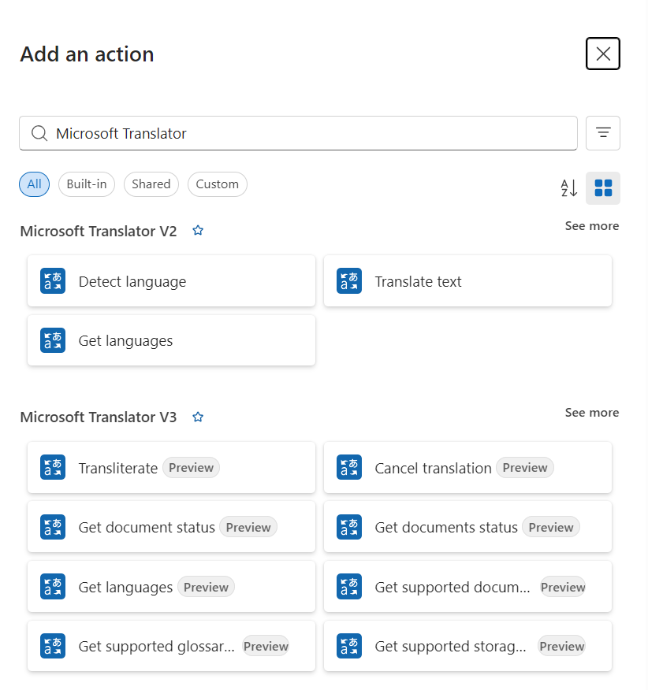
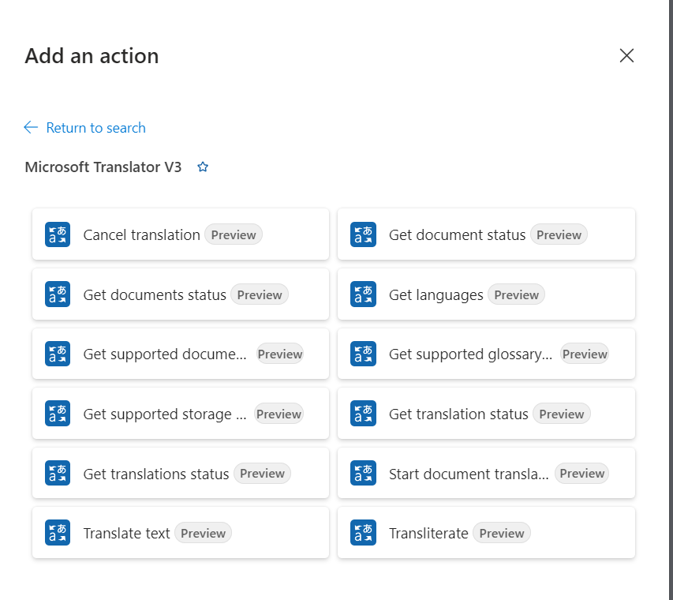
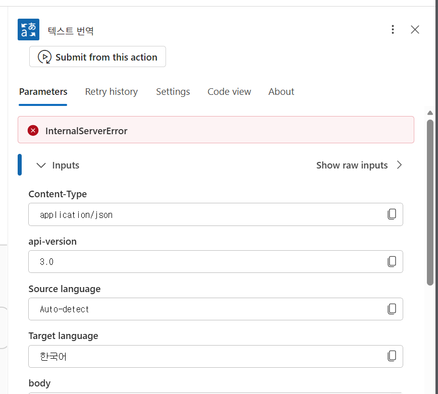
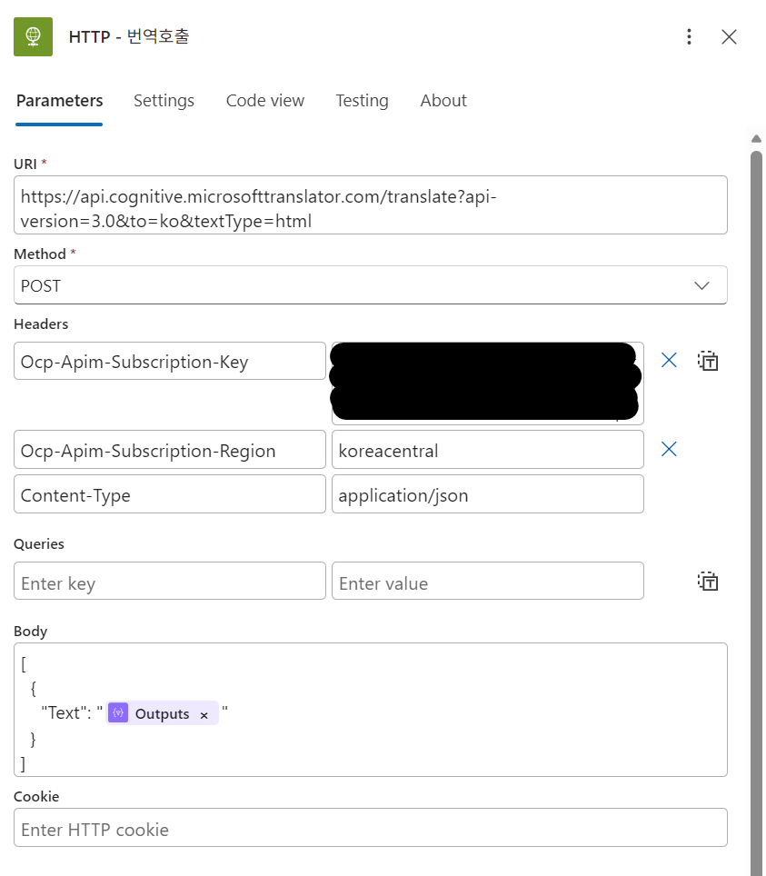

# Azure Logic App에서 HTTP 액션으로 Translator API 호출하기

Microsoft Azure Cognitive Services Translator 서비스를 Logic App에서 사용하는 방법은 Connector를 사용하는 것이다.

현재(2026년 2월 기준)는 v3(미리보기)까지 제공되고 있으며, v2 버전도 여전히 유효하다.

v3 버전은 v2에 비해서 더 많은 기능들을 제공한다(너무 당연하다!)

> v3 connector에 대해서는 [Microsoft Translator V3(미리 보기)](https://learn.microsoft.com/ko-kr/connectors/microsofttranslatorv/)를 참고

설정이 매우 간편해서 Translator와 같이 잘 준비된 서비스들은 connector를 이용하는 편인데, 오류가 발생되는 경우 debugging이 용이하지 않다는 **치명적인** 단점이 존재한다.

근래(2026년 1~2월 기준)에 다음과 같이 알수 없는(찾지 못한) internal server error를 몇 차례 겪다보니, 대안을 찾아야만 했다.

가장 간편한 대안은 http로 해당 서비스를 직접 호출하는 것이다.

설정은 매우 간단하다.

http action을 추가하고, 다음과 같이 설정하면 된다.

* URL : 
    * 기본적으로 다음과 같이 사용하였다.
        * https://api.cognitive.microsofttranslator.com/translate?api-version=3.0&to=ko&textType=html
    * translator API의 spec에 대해서는 다음의 링크를 참고하여 URL을 조합하면 된다.
        * https://learn.microsoft.com/en-us/azure/ai-services/translator/text-translation/reference/rest-api-guide
* Method : POST
* Headers에는 다음의 값들을 추가한다
    * Ocp-Apim-Subscription-Key : Translator API의 key를 입력한다.
    * Ocp-Apim-Subscription-Region : trnaslator API가 생성된 지역의 이름을 기술한다.
    * Content-Type : application/json
* Body : 번역하려는 text를 지정하면 된다. 

✍️ 2026년 2월 18일 씀.